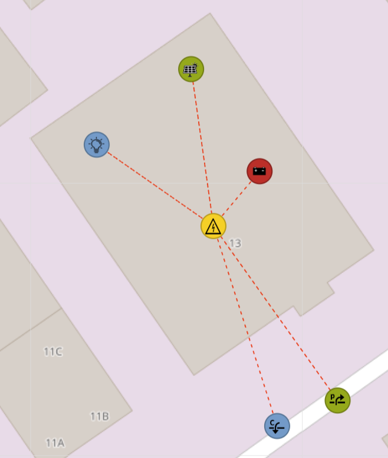
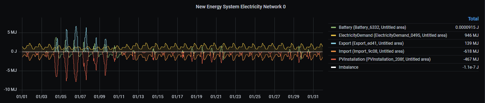
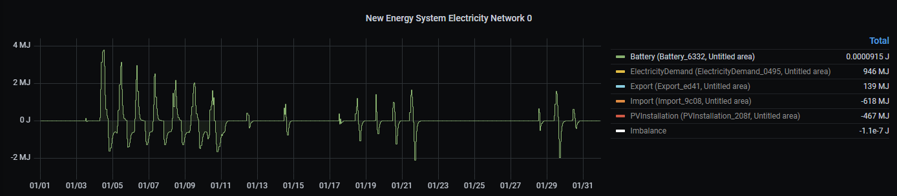

# ESSIM Battery model

This is an implementation of an external ESSIM model that behaves as a battery.

## Usage

### Example energy system
The ESDL energy system in the example consists of the following assets:
- an ElectricityDemand with a NEDU E1A profile
- a PVInstallation with a Zon_deBilt profile
- a Battery, of which the behaviour is modelled by the code in this repository
- an ElectricityNetwork, an Import and an Export to connect everything and to consume energy from
and deliver energy back to the grid.



### 1. Run the base infrastructure

Run the base infrastructure, consisting of ESSIM (Energy System SIMulator), a MQTT broker (Mosquitto), MongoDB, InfluxDB and Grafana

```shell
docker-compose up -d
```

### 2. Load some basic profiles into InfluxDB

From the `data` directory, run the `upload_profiles.py` script.

### 3. Run the Python application

From the `tno/essim_battery` directory start `app.py` with the following environment variables:
- PYTHONUNBUFFERED = 1
- MODEL_ID = BATT1
- LOG4P_JSON_LOCATION = ../shared/log4p.json

The second variable (MODEL_ID) determines to what MQTT topic ESSIM will send messages.
BATT1 in this case is the asset ID of the battery in the example ESDL file that is provided in this repository.

### 4. Start a simulation

Send an HTTP post message with the following body to the ESSIM REST endpoint (http://localhost:8112/essim/simulation):

```json
{
    "user": "essim",
    "scenarioID": "essim_battery",
    "simulationDescription": "External battery model",
    "startDate": "2019-01-01T00:00:00+0100",
    "endDate": "2019-01-31T23:00:00+0100",
    "influxURL": "http://influxdb:8086",
    "grafanaURL": "http://grafana:3000",
    "nodeConfig": [{
        "esdlNodeId": "BATT1",
        "config": {
            "influxUrl": "http://localhost:8086",
            "scenarioID": "essim_battery",
            "startDate": "2019-01-01T00:00:00+0100",
            "endDate": "2019-01-31T23:00:00+0100"
        },
        "mqttHost": "mqtt",
        "mqttPort": 1883,
        "mqttTopic": "essim"
    }],
    "esdlContents": "PD94bWwgdmVyc2lvbj0nMS4wJyBlbmNvZGluZz0nVVRGLTgnPz4NCjxlc2RsOkVuZXJneVN5c3RlbSB4bWxuczp4c2k9Imh0dHA6Ly93d3cudzMub3JnLzIwMDEvWE1MU2NoZW1hLWluc3RhbmNlIiB4bWxuczplc2RsPSJodHRwOi8vd3d3LnRuby5ubC9lc2RsIiBlc2RsVmVyc2lvbj0idjIxMDIiIGRlc2NyaXB0aW9uPSIiIHZlcnNpb249IjMiIG5hbWU9Ik5ldyBFbmVyZ3kgU3lzdGVtIiBpZD0iZjg5Y2Q4ODUtODEyYy00NGY5LTgwY2MtNWE3ZGViZDBjZDY2Ij4NCiAgPGluc3RhbmNlIHhzaTp0eXBlPSJlc2RsOkluc3RhbmNlIiBuYW1lPSJVbnRpdGxlZCBpbnN0YW5jZSIgaWQ9IjIzZTVkYWNjLTdhMDMtNDEyZC1iNmVhLTBhYmY3ZTRmOGZkYiI+DQogICAgPGFyZWEgeHNpOnR5cGU9ImVzZGw6QXJlYSIgbmFtZT0iVW50aXRsZWQgYXJlYSIgaWQ9ImUyMDFkMGMyLTkyOTItNGVmNy04OGExLTUyNWZkZjJjNzY5YyI+DQogICAgICA8YXNzZXQgeHNpOnR5cGU9ImVzZGw6UFZJbnN0YWxsYXRpb24iIGlkPSIyMDhmZGYwMS0wNTY3LTQ4ODAtOTAwYS0yN2EwY2Y0MjNjZTYiIG5hbWU9IlBWSW5zdGFsbGF0aW9uXzIwOGYiPg0KICAgICAgICA8Z2VvbWV0cnkgeHNpOnR5cGU9ImVzZGw6UG9pbnQiIGxhdD0iNTIuMTc3NDc3MTkyMDc2OTY0IiBsb249IjUuMjY3NjYyNzAzOTkwOTM3Ii8+DQogICAgICAgIDxwb3J0IHhzaTp0eXBlPSJlc2RsOk91dFBvcnQiIG5hbWU9Ik91dCIgaWQ9IjVhODRmYTFlLTNlOTctNGI1Yy04MDFhLTBhZmJhYTZlNzY3MSIgY29ubmVjdGVkVG89ImFlM2IzYjljLWQ5NDYtNDUyMS1iZDRkLWZmZWRiMjZjMWMyNiIgY2Fycmllcj0iN2NiNjJkOTktMzU0YS00ODc1LThhMGYtMjg0MDE0MjcwYTQyIj4NCiAgICAgICAgICA8cHJvZmlsZSB4c2k6dHlwZT0iZXNkbDpJbmZsdXhEQlByb2ZpbGUiIGVuZERhdGU9IjIwMjAtMDEtMDFUMDA6MDA6MDAuMDAwMDAwKzAxMDAiIG11bHRpcGxpZXI9IjEwLjAiIHN0YXJ0RGF0ZT0iMjAxOS0wMS0wMVQwMDowMDowMC4wMDAwMDArMDEwMCIgZmlsdGVycz0iIiBpZD0iZTgwMTUzNDYtMjZiMi00MzQ0LTlmMDMtNTcwOWNhYWUyZjBjIiBwb3J0PSI4MDg2IiBtZWFzdXJlbWVudD0ic3RhbmRhcmRfcHJvZmlsZXMiIGRhdGFiYXNlPSJlbmVyZ3lfcHJvZmlsZXMiIGhvc3Q9Imh0dHA6Ly9pbmZsdXhkYiIgZmllbGQ9Ilpvbl9kZUJpbHQiPg0KICAgICAgICAgICAgPHByb2ZpbGVRdWFudGl0eUFuZFVuaXQgeHNpOnR5cGU9ImVzZGw6UXVhbnRpdHlBbmRVbml0UmVmZXJlbmNlIiByZWZlcmVuY2U9ImViMDdiY2NiLTIwM2YtNDA3ZS1hZjk4LWU2ODc2NTZhMjIxZCIvPg0KICAgICAgICAgIDwvcHJvZmlsZT4NCiAgICAgICAgPC9wb3J0Pg0KICAgICAgPC9hc3NldD4NCiAgICAgIDxhc3NldCB4c2k6dHlwZT0iZXNkbDpFbGVjdHJpY2l0eURlbWFuZCIgaWQ9IjA0OTU3OGY0LTg0NTUtNGUwNC1iMDk5LTgwOGMwMTMyNjljYyIgbmFtZT0iRWxlY3RyaWNpdHlEZW1hbmRfMDQ5NSI+DQogICAgICAgIDxnZW9tZXRyeSB4c2k6dHlwZT0iZXNkbDpQb2ludCIgQ1JTPSJXR1M4NCIgbGF0PSI1Mi4xNzczNjA0NDg3OTU4MSIgbG9uPSI1LjI2NzQyMzk4NzM4ODYxMiIvPg0KICAgICAgICA8cG9ydCB4c2k6dHlwZT0iZXNkbDpJblBvcnQiIG5hbWU9IkluIiBpZD0iY2Y1N2Q4MTUtNTEzNC00YzhkLWJjMjgtYWU5MDI5MWRkNWJiIiBjb25uZWN0ZWRUbz0iNmI2YTE1NjgtNGEyNy00MmM3LWJlMjktYzU0YzM4MmFlOTNhIiBjYXJyaWVyPSI3Y2I2MmQ5OS0zNTRhLTQ4NzUtOGEwZi0yODQwMTQyNzBhNDIiPg0KICAgICAgICAgIDxwcm9maWxlIHhzaTp0eXBlPSJlc2RsOkluZmx1eERCUHJvZmlsZSIgZW5kRGF0ZT0iMjAyMC0wMS0wMVQwMDowMDowMC4wMDAwMDArMDEwMCIgbXVsdGlwbGllcj0iMTAuMCIgc3RhcnREYXRlPSIyMDE5LTAxLTAxVDAwOjAwOjAwLjAwMDAwMCswMTAwIiBmaWx0ZXJzPSIiIGlkPSI1ZjYyNDljZC03MTg0LTQyNzEtYmRmZS1lZWM2ZjVmNzdkY2QiIHBvcnQ9IjgwODYiIG1lYXN1cmVtZW50PSJzdGFuZGFyZF9wcm9maWxlcyIgZGF0YWJhc2U9ImVuZXJneV9wcm9maWxlcyIgaG9zdD0iaHR0cDovL2luZmx1eGRiIiBmaWVsZD0iRTFBIj4NCiAgICAgICAgICAgIDxwcm9maWxlUXVhbnRpdHlBbmRVbml0IHhzaTp0eXBlPSJlc2RsOlF1YW50aXR5QW5kVW5pdFJlZmVyZW5jZSIgcmVmZXJlbmNlPSJlYjA3YmNjYi0yMDNmLTQwN2UtYWY5OC1lNjg3NjU2YTIyMWQiLz4NCiAgICAgICAgICA8L3Byb2ZpbGU+DQogICAgICAgIDwvcG9ydD4NCiAgICAgIDwvYXNzZXQ+DQogICAgICA8YXNzZXQgeHNpOnR5cGU9ImVzZGw6QmF0dGVyeSIgbWF4RGlzY2hhcmdlUmF0ZT0iMjAwMC4wIiBtYXhDaGFyZ2VSYXRlPSIyMDAwLjAiIGNhcGFjaXR5PSIyMTYwMDAwMC4wIiBpZD0iQkFUVDEiIGNvbnRyb2xTdHJhdGVneT0iY2IzZWI2NDMtYWVjOC00MzUxLWI1YmQtYWM2ZTU1Yjk5YTFmIiBuYW1lPSJCYXR0ZXJ5XzYzMzIiPg0KICAgICAgICA8Z2VvbWV0cnkgeHNpOnR5cGU9ImVzZGw6UG9pbnQiIENSUz0iV0dTODQiIGxhdD0iNTIuMTc3MzE5MzQxMDE5OTMiIGxvbj0iNS4yNjc4MzU3MDY0NzIzOTgiLz4NCiAgICAgICAgPHBvcnQgeHNpOnR5cGU9ImVzZGw6SW5Qb3J0IiBuYW1lPSJJbiIgaWQ9IjkxOTQyMjdmLTI4ZTEtNDkzZS1iYjZmLWIyNTc4NTJjNmI0NSIgY29ubmVjdGVkVG89IjZiNmExNTY4LTRhMjctNDJjNy1iZTI5LWM1NGMzODJhZTkzYSIgY2Fycmllcj0iN2NiNjJkOTktMzU0YS00ODc1LThhMGYtMjg0MDE0MjcwYTQyIi8+DQogICAgICA8L2Fzc2V0Pg0KICAgICAgPGFzc2V0IHhzaTp0eXBlPSJlc2RsOkltcG9ydCIgcG93ZXI9IjE1MDAwLjAiIGlkPSI5YzA4N2YxNy1jZWY4LTRmODQtOTU4Ni1kMTgzMDU5NzAyMmIiIG5hbWU9IkltcG9ydF85YzA4Ij4NCiAgICAgICAgPGNvc3RJbmZvcm1hdGlvbiB4c2k6dHlwZT0iZXNkbDpDb3N0SW5mb3JtYXRpb24iPg0KICAgICAgICAgIDxtYXJnaW5hbENvc3RzIHhzaTp0eXBlPSJlc2RsOlNpbmdsZVZhbHVlIiB2YWx1ZT0iMC45IiBpZD0iMjFkNzYxMDEtNGE5ZC00OTMyLWJkMDQtYzQ1MjNlYWYyY2I3IiBuYW1lPSJJbXBvcnRfOWMwOC1NYXJnaW5hbENvc3RzIi8+DQogICAgICAgIDwvY29zdEluZm9ybWF0aW9uPg0KICAgICAgICA8Z2VvbWV0cnkgeHNpOnR5cGU9ImVzZGw6UG9pbnQiIENSUz0iV0dTODQiIGxhdD0iNTIuMTc2OTY1MTA5Nzk2NjkiIGxvbj0iNS4yNjgwMzI4NDg4MzQ5OTIiLz4NCiAgICAgICAgPHBvcnQgeHNpOnR5cGU9ImVzZGw6T3V0UG9ydCIgbmFtZT0iT3V0IiBpZD0iMTk5N2IxYmQtZDYxNy00NWI1LWIxNDktMzg3MjIwN2Q5YWVhIiBjb25uZWN0ZWRUbz0iYWUzYjNiOWMtZDk0Ni00NTIxLWJkNGQtZmZlZGIyNmMxYzI2IiBjYXJyaWVyPSI3Y2I2MmQ5OS0zNTRhLTQ4NzUtOGEwZi0yODQwMTQyNzBhNDIiLz4NCiAgICAgIDwvYXNzZXQ+DQogICAgICA8YXNzZXQgeHNpOnR5cGU9ImVzZGw6RWxlY3RyaWNpdHlOZXR3b3JrIiBpZD0iZTNhNWQyNDQtM2NkNy00NWRkLWIyMWQtOTg1MzRlMWIwZWMzIiBuYW1lPSJFbGVjdHJpY2l0eU5ldHdvcmtfZTNhNSI+DQogICAgICAgIDxnZW9tZXRyeSB4c2k6dHlwZT0iZXNkbDpQb2ludCIgQ1JTPSJXR1M4NCIgbGF0PSI1Mi4xNzcyMzQ2OTY2MzAyOSIgbG9uPSI1LjI2NzcxOTAzMDM4MDI0OSIvPg0KICAgICAgICA8cG9ydCB4c2k6dHlwZT0iZXNkbDpJblBvcnQiIG5hbWU9IkluIiBpZD0iYWUzYjNiOWMtZDk0Ni00NTIxLWJkNGQtZmZlZGIyNmMxYzI2IiBjb25uZWN0ZWRUbz0iNWE4NGZhMWUtM2U5Ny00YjVjLTgwMWEtMGFmYmFhNmU3NjcxIDE5OTdiMWJkLWQ2MTctNDViNS1iMTQ5LTM4NzIyMDdkOWFlYSIgY2Fycmllcj0iN2NiNjJkOTktMzU0YS00ODc1LThhMGYtMjg0MDE0MjcwYTQyIi8+DQogICAgICAgIDxwb3J0IHhzaTp0eXBlPSJlc2RsOk91dFBvcnQiIG5hbWU9Ik91dCIgaWQ9IjZiNmExNTY4LTRhMjctNDJjNy1iZTI5LWM1NGMzODJhZTkzYSIgY29ubmVjdGVkVG89ImNmNTdkODE1LTUxMzQtNGM4ZC1iYzI4LWFlOTAyOTFkZDViYiA5MTk0MjI3Zi0yOGUxLTQ5M2UtYmI2Zi1iMjU3ODUyYzZiNDUgNzA2NzE0NGYtYjgyMC00YWFjLWE3YWEtMzcyODVkN2MyNzYyIiBjYXJyaWVyPSI3Y2I2MmQ5OS0zNTRhLTQ4NzUtOGEwZi0yODQwMTQyNzBhNDIiLz4NCiAgICAgIDwvYXNzZXQ+DQogICAgICA8YXNzZXQgeHNpOnR5cGU9ImVzZGw6RXhwb3J0IiBwb3dlcj0iMTAwMDAuMCIgaWQ9ImVkNDEwYWNlLWUwNTAtNGFlMi1hNjFlLTRjYWQyZThjN2JkMyIgbmFtZT0iRXhwb3J0X2VkNDEiPg0KICAgICAgICA8Y29zdEluZm9ybWF0aW9uIHhzaTp0eXBlPSJlc2RsOkNvc3RJbmZvcm1hdGlvbiI+DQogICAgICAgICAgPG1hcmdpbmFsQ29zdHMgeHNpOnR5cGU9ImVzZGw6U2luZ2xlVmFsdWUiIHZhbHVlPSIwLjEiIGlkPSI3NDE3ZTlhMi1lNzdjLTQxYjQtYTc3MS0wMTk1YTA2OGFmOTQiIG5hbWU9IkV4cG9ydF9lZDQxLU1hcmdpbmFsQ29zdHMiLz4NCiAgICAgICAgPC9jb3N0SW5mb3JtYXRpb24+DQogICAgICAgIDxnZW9tZXRyeSB4c2k6dHlwZT0iZXNkbDpQb2ludCIgQ1JTPSJXR1M4NCIgbGF0PSI1Mi4xNzY5MjU1NzE5MDAwMyIgbG9uPSI1LjI2Nzg3OTk2MjkyMTE0MzUiLz4NCiAgICAgICAgPHBvcnQgeHNpOnR5cGU9ImVzZGw6SW5Qb3J0IiBuYW1lPSJJbiIgaWQ9IjcwNjcxNDRmLWI4MjAtNGFhYy1hN2FhLTM3Mjg1ZDdjMjc2MiIgY29ubmVjdGVkVG89IjZiNmExNTY4LTRhMjctNDJjNy1iZTI5LWM1NGMzODJhZTkzYSIgY2Fycmllcj0iN2NiNjJkOTktMzU0YS00ODc1LThhMGYtMjg0MDE0MjcwYTQyIi8+DQogICAgICA8L2Fzc2V0Pg0KICAgIDwvYXJlYT4NCiAgPC9pbnN0YW5jZT4NCiAgPHNlcnZpY2VzIHhzaTp0eXBlPSJlc2RsOlNlcnZpY2VzIiBpZD0iOTQ5MDRiZjEtZWY0Ny00NGY2LTg2MmMtOGJmOWYzMDAwNWIxIj4NCiAgICA8c2VydmljZSB4c2k6dHlwZT0iZXNkbDpTdG9yYWdlU3RyYXRlZ3kiIGVuZXJneUFzc2V0PSJCQVRUMSIgaWQ9ImNiM2ViNjQzLWFlYzgtNDM1MS1iNWJkLWFjNmU1NWI5OWExZiIgbmFtZT0iU3RvcmFnZVN0cmF0ZWd5IGZvciBCYXR0ZXJ5XzYzMzIiPg0KICAgICAgPG1hcmdpbmFsRGlzY2hhcmdlQ29zdHMgeHNpOnR5cGU9ImVzZGw6U2luZ2xlVmFsdWUiIHZhbHVlPSIwLjgiIGlkPSI2NGJmYWQzNy04ZTE0LTQxNWUtYmEwZC1hY2MyNWJiNmU1YmQiIG5hbWU9Im1hcmdpbmFsQ2hhcmdlQ29zdHMgZm9yIEJhdHRlcnlfNjMzMiIvPg0KICAgICAgPG1hcmdpbmFsQ2hhcmdlQ29zdHMgeHNpOnR5cGU9ImVzZGw6U2luZ2xlVmFsdWUiIHZhbHVlPSIwLjIiIGlkPSI4YzhlNTA1Yi1jM2VhLTQyOTQtOGU5OS1mNDk3NWIwZWRhZTgiIG5hbWU9Im1hcmdpbmFsQ2hhcmdlQ29zdHMgZm9yIEJhdHRlcnlfNjMzMiIvPg0KICAgIDwvc2VydmljZT4NCiAgPC9zZXJ2aWNlcz4NCiAgPGVuZXJneVN5c3RlbUluZm9ybWF0aW9uIHhzaTp0eXBlPSJlc2RsOkVuZXJneVN5c3RlbUluZm9ybWF0aW9uIiBpZD0iZmRiY2QyOTktNTk4Ny00NDczLTlmZDgtYTRkOTRhMjdmMjQ3Ij4NCiAgICA8Y2FycmllcnMgeHNpOnR5cGU9ImVzZGw6Q2FycmllcnMiIGlkPSI0YzViYzExNi0yOWM4LTQ5ZmYtOTMyNS1jMmUzYjRjNmMzMzIiPg0KICAgICAgPGNhcnJpZXIgeHNpOnR5cGU9ImVzZGw6RWxlY3RyaWNpdHlDb21tb2RpdHkiIG5hbWU9IkVsZWN0cmljaXR5IiBpZD0iN2NiNjJkOTktMzU0YS00ODc1LThhMGYtMjg0MDE0MjcwYTQyIi8+DQogICAgPC9jYXJyaWVycz4NCiAgICA8cXVhbnRpdHlBbmRVbml0cyB4c2k6dHlwZT0iZXNkbDpRdWFudGl0eUFuZFVuaXRzIiBpZD0iMzM0MDM0ODMtYzAwZS00YzRhLWJhODctODQyNTg3MDQwN2U2Ij4NCiAgICAgIDxxdWFudGl0eUFuZFVuaXQgeHNpOnR5cGU9ImVzZGw6UXVhbnRpdHlBbmRVbml0VHlwZSIgcGh5c2ljYWxRdWFudGl0eT0iRU5FUkdZIiBtdWx0aXBsaWVyPSJHSUdBIiBpZD0iZWIwN2JjY2ItMjAzZi00MDdlLWFmOTgtZTY4NzY1NmEyMjFkIiBkZXNjcmlwdGlvbj0iRW5lcmd5IGluIEdKIiB1bml0PSJKT1VMRSIvPg0KICAgIDwvcXVhbnRpdHlBbmRVbml0cz4NCiAgPC9lbmVyZ3lTeXN0ZW1JbmZvcm1hdGlvbj4NCjwvZXNkbDpFbmVyZ3lTeXN0ZW0+DQo="
}
```
This json file is also stored in the `docs\experiment_simple` directory.

### 5. Visualize the results

In the ESSIM output logs the dashboard URL is displayed (something like (!): http://localhost:3000/d/jAca7rHVz/new-energy-system-essim-2022-11-01t10-56-05-354?orgId=1).



Loading and unloading of the battery.



### Time control windows
The timing of charge and discharge can be controlled by using Time Control Windows, see the example json below:
In addition to the `start_hour` and `end_hour`, an `always_charge_below_fill_fraction` and `always_discharge_above_fill_fraction` can be specified.
An `always_charge_below_fill_fraction` of `0.25` means that the battery will always be charged when the state of charge is below 25%, also outside the `chargeTimeWindows`. 

```json
{
  "user": "essim",
  "scenarioID": "5_pvbatt",
  "simulationDescription": "5-pv_3400kWh_batt_6kWh_2kW_tcw11h14h",
  "startDate": "2019-01-01T00:00:00+0100",
  "endDate": "2019-01-31T23:00:00+0100",
  "influxURL": "http://influxdb:8086",
  "grafanaURL": "http://grafana:3000",
  "nodeConfig": [
    {
      "esdlNodeId": "BATT1",
      "config": {
        "influxUrl": "http://localhost:8086",
        "scenarioID": "5_pvbatt",
        "startDate": "2019-01-01T00:00:00+0100",
        "endDate": "2019-01-31T23:00:00+0100",
        "chargeTimeWindows": {
          "always_charge_below_fill_fraction": "0.25",
          "windows": [
            {
              "start_hour": "12",
              "end_hour": "24"
            }
          ]
        },
        "dischargeTimeWindows": {
          "always_discharge_above_fill_fraction": "0.75",
          "windows": [
            {
              "start_hour": "7",
              "end_hour": "10"
            },
            {
              "start_hour": "18",
              "end_hour": "23"
            }
          ]
        }
      },
      "mqttHost": "mqtt",
      "mqttPort": 1883,
      "mqttTopic": "essim"
    }
  ],
  "esdlContents": "<<ESDL>>"
}

```
This json file is also stored in the `docs` directory.
